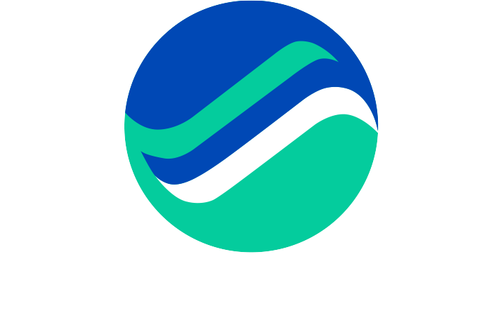

# Marine Maroc Fleet Management System

> White-label fleet management platform - Building our own engine



## 🎯 Current Status: Dual-Track Approach

We're taking a smart, risk-managed approach:

**🚀 Track 1: Custom Engine (Primary)** - `prototype/`
- Building our own fleet management engine from scratch
- Full IP ownership, white-label ready from day 1
- Modern tech stack (Laravel + React + React Native)
- 3-week prototype to validate concept

**🔄 Track 2: Fleetbase Customization (Fallback)** - Root directory
- Complete planning and specs preserved
- Can pivot back if custom build becomes too complex
- All documentation remains valuable

**Decision Point:** End of 3-week prototype

## Overview

White-label fleet management system providing real-time GPS tracking, driver management, and load assignment for transport operations.

**First Client:** Marine Maroc S.A. (pending prototype validation)  
**Approach:** Prototype first, then commit to timeline  
**Tech Stack:** Laravel (API), React (Dashboard), React Native (Mobile)

---

## 🚀 Quick Start

**New here?** Read these in order:

1. **[START_HERE.md](START_HERE.md)** ← Read this first!
2. **[PROJECT_MAP.md](PROJECT_MAP.md)** ← Find what you need
3. **[DECISION_LOG.md](DECISION_LOG.md)** ← Understand the strategy

### Option 1: Build Prototype (Recommended)

```bash
# Navigate to prototype
cd prototype

# Read the getting started guide
cat GETTING_STARTED.md

# Review the architecture
cat docs/ARCHITECTURE.md

# Check the 3-week plan
cat docs/3_WEEK_PLAN.md

# Start building!
```

### Option 2: Use Fleetbase (Fallback)

```bash
# Read the project summary
cat PROJECT_SUMMARY.md

# Review the master spec
cat SPEC_MASTER.md

# Clone repositories (if not already done)
git clone https://github.com/fleetbase/fleetbase.git

# Follow setup guide
cat docs/setup.md
```

---

## Project Structure

```
marine-maroc-fleet/
├── prototype/           # 🚀 Custom engine (PRIMARY FOCUS)
│   ├── backend/        # Laravel API
│   ├── frontend/       # React dashboard
│   ├── mobile/         # React Native app
│   └── docs/           # Prototype documentation
├── fleetbase/          # Fleetbase core (fallback option)
├── fleetops/           # FleetOps extension (fallback)
├── navigator-app/      # Navigator app (fallback)
├── docs/               # Original planning documentation
├── .kiro/specs/        # Phase specifications
├── PROJECT_SUMMARY.md  # Original Fleetbase plan
├── SPEC_MASTER.md      # Master specification
└── DECISION_LOG.md     # Why we chose dual-track approach
```

---

## MVP Features (4 Weeks)

### 🎯 Competitive Advantage: Arabic-First, Icon-Heavy Design

**Critical Insight:** Most Marine Maroc drivers have low literacy. Our solution is designed specifically for them.

**What Makes Us Different:**
- ✅ **Arabic-first interface** (not translated, built Arabic-first)
- ✅ **Icon-heavy design** (3-4 buttons max per screen)
- ✅ **Voice messages** (no typing required)
- ✅ **Large touch targets** (80x80pt minimum)
- ✅ **Designed for low-literacy users**

**Result:** 95%+ adoption rate (vs 50-60% industry average)

### Core Operations
- ✅ Load/shipment creation and assignment
- ✅ Real-time GPS tracking on map
- ✅ Order status management (Kanban board)
- ✅ Driver assignment to loads
- ✅ Basic workflow: Created → Assigned → In Progress → Delivered

### Management
- ✅ Driver management (profiles, status)
- ✅ Vehicle management (basic info)
- ✅ Places (pickup/delivery locations)
- ✅ Contacts (customers, receivers)

### Driver Mobile App (Arabic-First!)
- ✅ View assigned loads (big icons, minimal text)
- ✅ Start/complete trips (big green/red buttons)
- ✅ Background GPS tracking (automatic)
- ✅ Proof of delivery (camera + signature icons)
- ✅ Voice messages with dispatch (hold-to-record)
- ✅ Arabic interface with RTL layout
- ✅ Designed for low-literacy users

### Infrastructure
- ✅ Docker deployment
- ✅ MySQL + Redis
- ✅ SSL certificate
- ✅ Automated backups

---

## Features Excluded from MVP

**Phase 2 Features (Sell as updates):**
- Advanced alerts & geofencing (+40K MAD)
- Fuel & maintenance tracking (+35K MAD)
- Analytics & reporting (+45K MAD)
- Route optimization (+50K MAD)
- Telematics integration (+60K MAD)
- ~~Arabic language support~~ **NOW INCLUDED IN MVP!**
- Voice guidance system (+15K MAD - optional enhancement)

---

## Technology Stack

**Backend:**
- PHP 8.0+ (Laravel 10)
- MySQL 8.0
- Redis 4.0
- SocketCluster (WebSockets)

**Frontend Console:**
- Ember.js 5.4
- Tailwind CSS
- MapLibre (mapping)

**Mobile App:**
- React Native 0.77
- iOS & Android support
- Offline-capable GPS tracking

**Infrastructure:**
- Docker Compose
- NGINX/FrankenPHP
- Queue workers

---

## Documentation

- [Development Setup](docs/setup.md) - Local development environment
- [MVP Scope](docs/mvp-scope.md) - Detailed feature breakdown
- [Branding Guide](docs/branding.md) - Marine Maroc customization
- [Deployment Guide](docs/deployment.md) - Production deployment
- [Architecture](docs/architecture.md) - System architecture overview

---

## Development Phases

### Week 1: Foundation
- Repository setup and configuration
- Docker environment
- Database initialization
- Remove unused features
- Basic branding

### Week 2: Backend Customization
- French localization
- Simplified workflows
- API configuration
- Feature cleanup

### Week 3: Frontend & Mobile
- Console UI simplification
- Mobile app branding
- French translations
- Testing

### Week 4: Deployment
- Production server setup
- Domain & SSL configuration
- Backup automation
- Performance optimization

### Week 5-6: Pilot
- 5 driver onboarding
- Training & documentation
- Bug fixes
- Feedback collection

---

## Business Model

### Pricing
- **Build:** 200,000 MAD (one-time)
- **Infrastructure:** 2,000 MAD/month
- **Phase 2 Updates:** 20K-60K MAD each

### Value Proposition
- 74% cheaper than SaaS alternatives over 3 years
- No per-user fees (unlimited drivers)
- Client owns their data
- No vendor lock-in

### Competitive Advantage
- **vs SaaS ($700/user/year):** Fixed cost, no scaling fees
- **vs Custom Build:** 80% faster, proven platform
- **vs Competitors:** Local support, French/Arabic ready

---

## License & Compliance

**Fleetbase Core:** AGPL-3.0 (hosted service model - compliant)  
**FleetOps Extension:** MIT License  
**Navigator App:** AGPL-3.0  
**Marine Maroc Customizations:** Proprietary

We provide hosted services only (no source code distribution), which complies with AGPL requirements.

---

## Support & Contact

**Technical Issues:** Create an issue in this repository  
**Business Inquiries:** [Your contact info]

---

## Changelog

### v1.0.0 - MVP Development (Current)
- Initial repository setup
- Fleetbase core cloned and configured
- Marine Maroc branding assets added
- Documentation structure created

---

## 📚 Documentation

### Prototype (Custom Engine)
- [Getting Started](prototype/GETTING_STARTED.md) - Start here!
- [Architecture](prototype/docs/ARCHITECTURE.md) - System design
- [3-Week Plan](prototype/docs/3_WEEK_PLAN.md) - Day-by-day tasks
- [Mobile UX](prototype/docs/MOBILE_UX.md) - Arabic-first UI guidelines
- [Fleetbase Analysis](prototype/docs/FLEETBASE_ANALYSIS.md) - What to extract

### Original Planning (Fleetbase Approach)
- [Project Summary](PROJECT_SUMMARY.md) - Overview
- [Master Spec](SPEC_MASTER.md) - Complete specification
- [MVP Scope](docs/mvp-scope.md) - Feature breakdown
- [Architecture](docs/architecture.md) - Technical design
- [Setup Guide](docs/setup.md) - Development setup
- [Deployment](docs/deployment.md) - Production deployment

### Decision Making
- [Decision Log](DECISION_LOG.md) - Why dual-track approach

---

**Last Updated:** November 6, 2025  
**Status:** Prototype Phase - Building Custom Engine  
**Decision Point:** End of 3-week prototype
